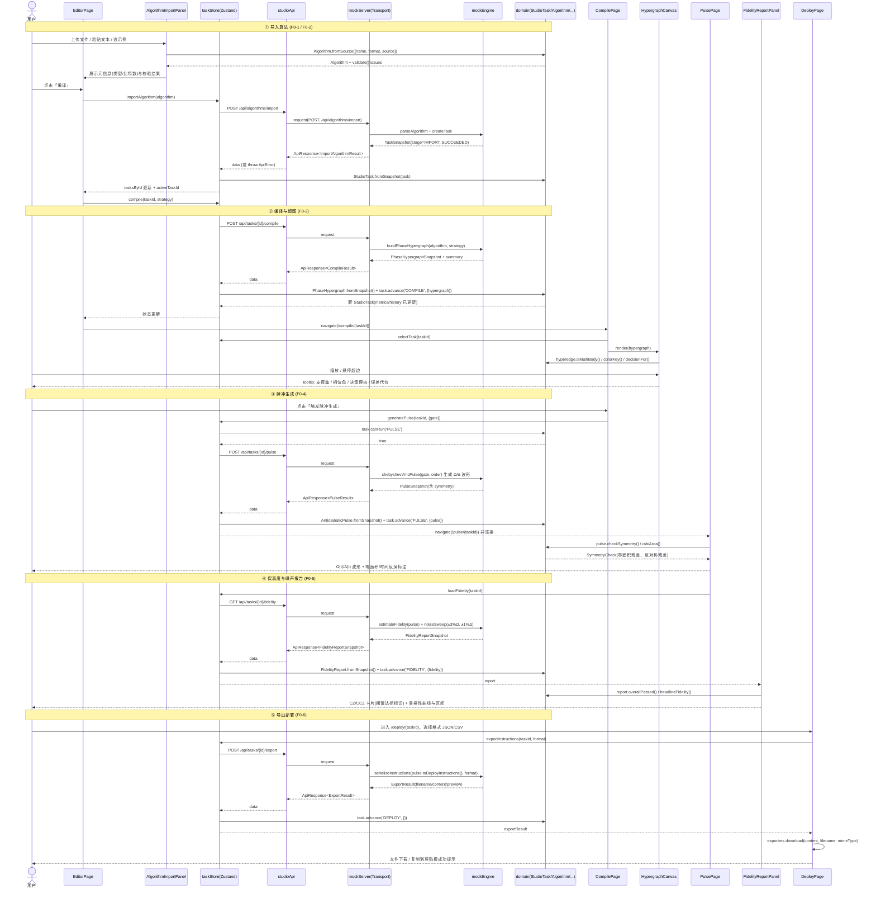
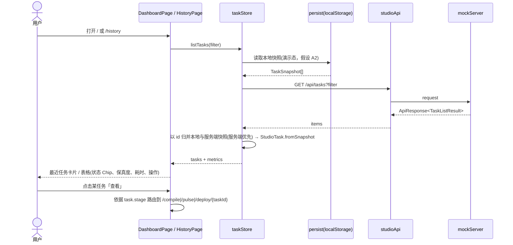
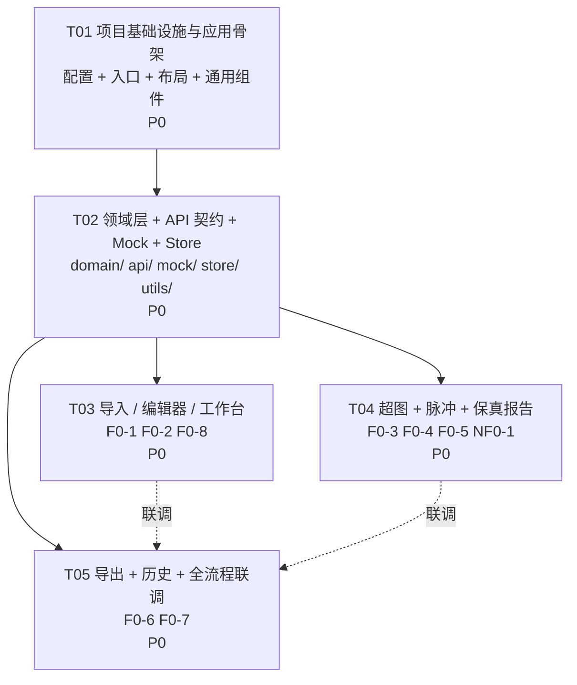

# NeuPulse Studio 用户侧前端 · 系统设计与任务分解

> 项目：原昇量子 · 中性原子（里德伯）量子机全栈控制软件 — 用户侧前端
> 产品：NeuPulse Studio（CaaS，SaaS / 私有化交付）
> 上游输入：`PRD.md`（许清楚 / 产品经理）
> 作者：高见远（架构师）
> 文档类型：系统设计 + 任务分解（不含实现代码）
> 版本：v1.0

---

## 目录

1. [实现方案概述与技术栈选型](#1-实现方案概述与技术栈选型)
2. [文件列表与目录结构](#2-文件列表与目录结构)
3. [数据结构与接口](#3-数据结构与接口)
4. [程序调用流程](#4-程序调用流程)
5. [任务列表（有序 · 含依赖）](#5-任务列表有序--含依赖)
6. [依赖包列表](#6-依赖包列表)
7. [共享知识（跨文件约定）](#7-共享知识跨文件约定)
8. [待明确事项](#8-待明确事项)

---

## 1. 实现方案概述与技术栈选型

### 1.1 核心难点分析

| # | 难点 | 说明 | 设计对策 |
|---|------|------|----------|
| D1 | **量子领域概念复杂** | 相位超图、反绝热脉冲、AGP/切比雪夫–VMC、保真度阈值等概念嵌套深，若直接把后端 JSON 摊平进组件，会出现"组件里算物理"的失控局面 | 建立**独立领域层 `src/domain/`**：把 6 个核心实体建成 TypeScript 类（不可变对象 + 行为方法），组件只消费领域对象的 getter 与派生指标 |
| D2 | **超图可视化非标准图形** | 超边是"多体相位项"（支撑集大小 ≥ 3），普通图库只画二元边，画不出超边 | **自绘 SVG 组件**：超边渲染为"支撑集凸包 / 星型中心节点"，节点用力导向预布局（布局坐标由 Mock/后端下发，前端只做视口变换），支持缩放 + 悬停 |
| D3 | **流水线五态强依赖** | 导入→编译→脉冲→保真→部署，后一步必须校验前一步产物存在，否则页面直接崩 | 领域层 `StudioTask` 实现**显式状态机**：`canRun(stage)` 做前置校验，路由页面统一走 `AsyncBoundary` 兜底（缺前置产物 → 引导回上一步） |
| D4 | **后端未就绪** | 算法引擎（Möbius 编译 / 切比雪夫–VMC / RAP）尚未接入 | **契约先行**：`src/api/contracts.ts` 定义 DTO 与统一响应包，`src/mock/` 实现同契约的内存 Mock（含延时与失败注入）；后续替换只改 `studioApi` 的 transport 一层 |
| D5 | **物理不变量需要可视化校验** | Ω(t) 反对称零面积、Δ(t) 对称、双脉冲时间反演对称，是产品的差异化卖点，必须能"看得见" | `AntidiabaticPulse.checkSymmetry()` 在前端做数值复核（梯形积分求面积残差 + 对称性偏差），波形图上以标注/徽标呈现，与后端声明值互相印证 |
| D6 | **错误处理与重试** | NF0-2 要求导入/编译/生成失败有清晰提示与重试入口 | 统一 `ApiError`（code + retryable）+ store 内 per-stage 错误槽位 + `AsyncBoundary` 的 retry 回调，重试复用同一 action |

### 1.2 架构分层（面向对象 + 组件化）

```
┌──────────────────────────────────────────────────────────────┐
│  展示层 Presentation   pages/ + components/                   │
│  纯函数组件，不含物理计算；只读领域对象、只调 store action      │
├──────────────────────────────────────────────────────────────┤
│  应用层 Application    store/（Zustand）                       │
│  编排流水线：调用 api → 反序列化为领域对象 → 更新状态/错误槽   │
├──────────────────────────────────────────────────────────────┤
│  领域层 Domain         domain/（TS class，框架无关、可单测）    │
│  Algorithm / PhaseHypergraph / Hyperedge / CompileDecision /  │
│  AntidiabaticPulse / FidelityReport / StudioTask（状态机）      │
├──────────────────────────────────────────────────────────────┤
│  契约层 Contract       api/contracts.ts（DTO / Snapshot）      │
│  领域对象 ⇄ Snapshot 双向转换，Snapshot 即传输/持久化形态       │
├──────────────────────────────────────────────────────────────┤
│  基础设施层 Infra      api/studioApi.ts + mock/               │
│  transport 可插拔：MockTransport（当前）/ HttpTransport（未来） │
└──────────────────────────────────────────────────────────────┘
```

**关键约束（单向依赖）**：`pages → components → store → api → domain`，领域层不 import 任何上层与任何框架代码（不 import React / MUI / Zustand）。

### 1.3 面向对象设计要点（响应"面向对象的网页"）

1. **实体即类**：6 个量子领域概念一一对应 TS 类，字段带类型标注，行为内聚在类上（如 `Hyperedge.isMultiBody`、`FidelityReport.overallPassed`、`AntidiabaticPulse.rabiArea`）。
2. **不可变 + 快照**：所有实体不可变；`toSnapshot()` / `static fromSnapshot()` 承担序列化（localStorage 持久化与 API DTO 同构），策略切换等"修改"通过 `withStrategy()` 返回新对象。
3. **富模型而非贫血模型**：派生指标（native 占比、总误差代价、保真度是否达标、对称性残差）由领域对象计算，组件不重复实现。
4. **组件围绕对象组织**：`components/hypergraph/*` 只吃 `PhaseHypergraph`，`components/pulse/*` 只吃 `AntidiabaticPulse` / `FidelityReport`，形成"对象 → 视图"的一对一映射，便于替换与复用。
5. **状态机封装**：`StudioTask.advance(stage, patch)` 是唯一的流水线推进入口，历史事件（`TaskEvent[]`）自动追加，天然满足 F0-7 历史仪表盘与"编译决策可追溯审计"诉求。

### 1.4 技术栈选型

| 层次 | 选型 | 理由 |
|------|------|------|
| 构建 | **Vite 5 + TypeScript 5（strict）** | 冷启动快、DX 好；strict 保障领域模型类型安全 |
| 框架 | **React 18** | 生态成熟，团队默认栈 |
| 组件库 | **MUI 5** | 表格/对话框/Stepper/Chip 等企业级组件齐全，暗色主题内置（P1 NF1-3 可平滑接入） |
| 原子化样式 | **Tailwind CSS 4（@tailwindcss/vite）** | 布局与响应式（NF0-3）书写高效；**不引入 preflight**，避免与 MUI 基线样式冲突 |
| 状态管理 | **Zustand 4 + persist** | 比 Redux 轻、比 Context 少重渲染；`persist` 直接满足"演示态本地存储任务"（假设 A2） |
| 路由 | **React Router 6** | 路由与 PRD 5.1 一一对应，`/compile/:taskId` 等参数化路由天然支持 |
| 图表 | **Recharts 2** | 脉冲波形 / 噪声鲁棒性曲线（声明式、体积可接受）；**超图不用图库，自绘 SVG** |
| 测试（可选） | Vitest | 领域层纯函数/纯类，单测成本极低，建议至少覆盖 `checkSymmetry` 与 `StudioTask` 状态机 |

### 1.5 待确认问题的处理假设（A1–A5，见第 8 节）

| 假设 | 内容 | 在设计中的落点 |
|------|------|----------------|
| **A1** | MVP 采用**前端内置 Mock 服务**（TS 假数据 + 模拟异步延时），接口按契约定义 | `src/mock/`（mockEngine + mockServer）；契约在 `src/api/contracts.ts` |
| **A2** | MVP **不做登录鉴权**，演示态 + 本地存储任务 | `store/taskStore.ts` 挂 `persist`；`AppLayout` 顶栏用户区留占位 |
| **A3** | 技术栈 = Vite + React + TS + MUI + Tailwind | 见 1.4 |
| **A4** | 超图**自绘 SVG**（节点 < 200）；波形与保真曲线用 **Recharts** | `HypergraphCanvas.tsx` / `PulseWaveformChart.tsx` |
| **A5** | 实时性用「提交 → 完成态」两步简化（Mock 延时），不接轮询/WebSocket | `studioApi` 单次 await；store 用 `pending[stage]` 布尔位；`TaskStatus.RUNNING` 保留字段以便 P1 接轮询 |

---

## 2. 文件列表与目录结构

共 **38 个文件**（源码 34 + 根配置 4）。已按"功能域合并至最小集合"，避免一文件一职责的碎片化。

```
yuansheng-frontend/
├── package.json                              # 依赖与脚本
├── vite.config.ts                            # Vite + React + Tailwind 插件 + path alias(@/)
├── tsconfig.json                             # strict、paths
├── index.html                                # 挂载点 #root
├── PRD.md                                    # （已存在）产品需求
├── DESIGN.md                                 # （本文档）
├── docs/
│   ├── class-diagram.mermaid                 # 领域类图（同第 3 节）
│   └── sequence-diagram.mermaid              # 主流程时序图（同第 4 节）
└── src/
    ├── main.tsx                              # 入口：ThemeProvider + CssBaseline + BrowserRouter
    ├── App.tsx                               # 路由表 + AppLayout 包裹
    ├── theme.ts                              # MUI 主题（配色/圆角/字号，暗色预留）
    ├── styles/
    │   └── index.css                         # Tailwind 分层引入(不含 preflight) + 全局变量
    ├── domain/                               # ★ 领域层（框架无关，纯 TS）
    │   ├── Algorithm.ts                      # Algorithm 类 + 解析/校验 + AlgorithmKind/SourceFormat
    │   ├── PhaseHypergraph.ts                # PhaseHypergraph / HypergraphNode / Hyperedge / CompileDecision
    │   ├── Pulse.ts                          # AntidiabaticPulse + 对称性复核 + 采样
    │   ├── FidelityReport.ts                 # FidelityReport / GateFidelity / NoiseRobustness
    │   ├── Task.ts                           # StudioTask 状态机 + TaskEvent / TaskMetrics / 枚举
    │   └── index.ts                          # barrel 导出（唯一对外入口）
    ├── api/
    │   ├── contracts.ts                      # 请求/响应 DTO、Snapshot 类型、ApiResponse 包、错误码表
    │   └── studioApi.ts                      # ApiError、Transport 接口、7 个端点方法、重试策略
    ├── mock/
    │   ├── mockEngine.ts                     # 假数据生成：超图布局、Ω/Δ 波形、保真度与噪声曲线、示例算法
    │   └── mockServer.ts                     # MockTransport：路由分发 + 内存库 + 延时 + 失败注入
    ├── store/
    │   ├── taskStore.ts                      # 流水线编排 + tasksById + pending/error 槽 + persist
    │   └── uiStore.ts                        # 全局 toast、主题模式、侧栏折叠
    ├── utils/
    │   └── exporters.ts                       # 指令序列化(JSON/CSV) + 下载/复制 + 数值格式化
    ├── pages/
    │   ├── DashboardPage.tsx                 # F0-8 工作台主页
    │   ├── EditorPage.tsx                    # F0-1/F0-2 导入与编辑器
    │   ├── CompilePage.tsx                   # F0-3 相位超图与编译摘要
    │   ├── PulsePage.tsx                     # F0-4/F0-5 脉冲与保真度报告
    │   ├── DeployPage.tsx                    # F0-6 导出部署指令
    │   └── HistoryPage.tsx                   # F0-7 任务与历史仪表盘
    └── components/
        ├── layout/
        │   ├── AppLayout.tsx                 # 顶栏 + 导航 + 内容容器 + 响应式(NF0-3) + Toast 出口
        │   └── PipelineStepper.tsx           # 五态流水线进度（导入→编译→脉冲→保真→部署）
        ├── common/
        │   └── index.tsx                     # AsyncBoundary(加载/错误/重试) + StatusChip + MetricCard + EmptyState
        ├── algorithm/
        │   ├── AlgorithmImportPanel.tsx      # 文件上传 + 文本粘贴 + 示例加载
        │   └── AlgorithmCodeEditor.tsx       # 行号文本区 + 校验错误标注 + 元信息面板
        ├── hypergraph/
        │   ├── HypergraphCanvas.tsx          # 自绘 SVG：节点/超边/相位配色/缩放/悬停 tooltip
        │   └── CompileSummaryPanel.tsx       # 编译摘要 + 决策表(原生 vs 分解/误差代价/理由) + 策略切换
        ├── pulse/
        │   ├── PulseWaveformChart.tsx        # Recharts：Ω(t)/Δ(t) 双轴 + 零面积/对称性标注
        │   └── FidelityReportPanel.tsx       # CZ/CCZ 保真度卡片 + ±3% 噪声鲁棒性曲线与区间
        ├── deploy/
        │   └── ExportPanel.tsx               # 格式选择 + 片段预览 + 下载/复制（私有化"直接下发"占位）
        └── history/
            └── TaskTable.tsx                 # 筛选/搜索/排序 + 指标列 + 查看/重试/对比入口
```

---

## 3. 数据结构与接口

### 3.1 领域模型类图（Mermaid）

```mermaid
classDiagram
    class Algorithm {
        +string id
        +string name
        +AlgorithmKind kind
        +SourceFormat format
        +int qubitCount
        +string source
        +string createdAt
        +Algorithm fromSource(input)
        +Algorithm fromSnapshot(snap)
        +ValidationIssue[] validate()
        +bool isValid()
        +Algorithm withSource(source)
        +AlgorithmSnapshot toSnapshot()
    }

    class ValidationIssue {
        +int line
        +int column
        +Severity severity
        +string code
        +string message
    }

    class HypergraphNode {
        +string id
        +int qubitIndex
        +string label
        +float x
        +float y
        +int degree
    }

    class Hyperedge {
        +string id
        +int[] support
        +float angle
        +int order
        +string gateLabel
        +bool isMultiBody()
        +float normalizedAngle()
        +string colorKey()
    }

    class CompileDecision {
        +string hyperedgeId
        +CompileStrategy strategy
        +float errorCost
        +int gateCount
        +string rationale
        +bool isNative()
    }

    class CompileSummary {
        +int nodeCount
        +int hyperedgeCount
        +int nativeCount
        +int decomposedCount
        +float nativeRatio
        +float totalErrorCost
        +int twoQubitGateCount
        +int estimatedDepth
    }

    class PhaseHypergraph {
        +string taskId
        +CompileStrategy strategy
        +HypergraphNode[] nodes
        +Hyperedge[] hyperedges
        +CompileDecision[] decisions
        +PhaseHypergraph fromSnapshot(snap)
        +CompileDecision decisionFor(hyperedgeId)
        +HypergraphNode[] neighborsOf(nodeId)
        +Map edgesByOrder()
        +CompileSummary summary()
        +PhaseHypergraph withStrategy(strategy)
        +PhaseHypergraphSnapshot toSnapshot()
    }

    class WaveformSample {
        +float t
        +float value
    }

    class SymmetryCheck {
        +bool rabiZeroArea
        +bool rabiAntisymmetric
        +bool detuningSymmetric
        +bool timeReversalPaired
        +float areaResidual
        +float antisymmetryResidual
    }

    class AntidiabaticPulse {
        +string taskId
        +GateType gate
        +DriverKind driver
        +float durationNs
        +float peakRabiMHz
        +float maxDetuningMHz
        +float[] chebyshevCoeffs
        +int vmcIterations
        +float vmcResidual
        +WaveformSample[] rabi
        +WaveformSample[] detuning
        +AntidiabaticPulse fromSnapshot(snap)
        +float rabiArea()
        +SymmetryCheck checkSymmetry()
        +object sampleAt(t)
        +DeployInstruction[] toDeployInstructions()
        +PulseSnapshot toSnapshot()
    }

    class GateFidelity {
        +GateType gate
        +float value
        +float threshold
        +bool passed
    }

    class NoisePoint {
        +float rabiDriftPct
        +float detuningDriftPct
        +float fidelity
    }

    class NoiseRobustness {
        +float rabiDriftPct
        +float detuningDriftPct
        +NoisePoint[] curve
        +float worstCase
        +float bestCase
        +float meanFidelity
    }

    class FidelityReport {
        +string taskId
        +GateFidelity[] gates
        +NoiseRobustness robustness
        +string generatedAt
        +FidelityReport fromSnapshot(snap)
        +GateFidelity gate(type)
        +float headlineFidelity()
        +bool overallPassed()
        +FidelityReportSnapshot toSnapshot()
    }

    class TaskEvent {
        +string at
        +PipelineStage stage
        +TaskStatus status
        +string message
    }

    class TaskMetrics {
        +float headlineFidelity
        +int hyperedgeCount
        +float nativeRatio
        +float totalErrorCost
        +float durationNs
    }

    class TaskError {
        +string code
        +string message
        +PipelineStage stage
        +bool retryable
    }

    class StudioTask {
        +string id
        +string name
        +PipelineStage stage
        +TaskStatus status
        +CompileStrategy strategy
        +TaskMetrics metrics
        +TaskEvent[] history
        +string createdAt
        +string updatedAt
        +StudioTask create(algorithm)
        +StudioTask fromSnapshot(snap)
        +bool canRun(stage)
        +StudioTask advance(stage, patch)
        +StudioTask fail(stage, error)
        +float progress()
        +TaskSnapshot toSnapshot()
    }

    class DeployInstruction {
        +int index
        +string channel
        +float tNs
        +float amplitudeMHz
        +float phaseRad
        +string gateLabel
    }

    StudioTask "1" *-- "1" Algorithm : 持有算法
    StudioTask "1" o-- "0..1" PhaseHypergraph : 编译产物
    StudioTask "1" o-- "0..1" AntidiabaticPulse : 脉冲产物
    StudioTask "1" o-- "0..1" FidelityReport : 保真产物
    StudioTask "1" *-- "0..*" TaskEvent : 历史事件
    StudioTask "1" *-- "1" TaskMetrics : 关键指标
    StudioTask "1" o-- "0..1" TaskError : 失败信息
    Algorithm "1" ..> "0..*" ValidationIssue : validate()
    PhaseHypergraph "1" *-- "1..*" HypergraphNode : 原子/比特
    PhaseHypergraph "1" *-- "0..*" Hyperedge : 多体相位项
    PhaseHypergraph "1" *-- "0..*" CompileDecision : 编译决策
    PhaseHypergraph "1" ..> "1" CompileSummary : summary()
    CompileDecision "1" --> "1" Hyperedge : 对应超边
    AntidiabaticPulse "1" *-- "2..*" WaveformSample : Ω(t)/Δ(t) 采样
    AntidiabaticPulse "1" ..> "1" SymmetryCheck : checkSymmetry()
    AntidiabaticPulse "1" ..> "0..*" DeployInstruction : 导出
    FidelityReport "1" *-- "1..*" GateFidelity : CZ/CCZ
    FidelityReport "1" *-- "1" NoiseRobustness : 噪声鲁棒性
    NoiseRobustness "1" *-- "0..*" NoisePoint : 涨落采样
```



### 3.2 领域字段表（关键实体）

**Algorithm**（`domain/Algorithm.ts`）

| 字段 | 类型 | 说明 |
|------|------|------|
| `id` | `string` | `alg_` + nanoid |
| `name` | `string` | 文件名或用户命名 |
| `kind` | `AlgorithmKind = 'QAOA' \| 'QRAM' \| 'DIAGONAL' \| 'HYPERGRAPH_STATE' \| 'CUSTOM'` | 解析推断，可手改 |
| `format` | `SourceFormat = 'QASM' \| 'JSON'` | 导入格式 |
| `qubitCount` | `number` | QASM 从 `qreg`/`qubit[n]` 推断；JSON 从 `qubits` 字段 |
| `source` | `string` | 原始文本 |
| `createdAt` | `string` | ISO 8601 UTC |
| 方法 | `validate(): ValidationIssue[]`、`isValid`、`withSource()`、`toSnapshot()`、`static fromSource()` | 校验规则：格式可解析、比特数 1–64、至少一条门指令、未知门告警 |

**Hyperedge / CompileDecision**（`domain/PhaseHypergraph.ts`）

| 字段 | 类型 | 说明 |
|------|------|------|
| `support` | `number[]` | 支撑集（比特下标集合），`order = support.length` |
| `angle` | `number` | 相位角，弧度，`[-π, π]` |
| `gateLabel` | `string` | 如 `CZ`、`CCZ`、`C3Z` |
| `isMultiBody()` | `boolean` | `order >= 3` |
| `colorKey()` | `string` | 由 `normalizedAngle()` 映射到配色档位（供 SVG 上色） |
| `strategy` | `'NATIVE_MULTIQUBIT' \| 'DECOMPOSED'` | 编译决策 |
| `errorCost` | `number` | 该超边的误差代价估计 |
| `gateCount` | `number` | 分解后所需两比特门数（原生为 1） |
| `rationale` | `string` | 决策理由（审计视图用） |

**AntidiabaticPulse**（`domain/Pulse.ts`）

| 字段 | 类型 | 说明 |
|------|------|------|
| `gate` | `GateType = 'CZ' \| 'CCZ' \| 'CkZ'` | 门类型 |
| `driver` | `DriverKind = 'CHEBYSHEV_VMC'` | 驱动生成方式 |
| `rabi` / `detuning` | `WaveformSample[]` | `t ∈ [0,1]` 归一化时间，`value` 单位 MHz |
| `chebyshevCoeffs` | `number[]` | 切比雪夫展开系数（AGP 逼近） |
| `vmcIterations` / `vmcResidual` | `number` | 变分求解迭代数与残差 |
| `rabiArea()` | `number` | 梯形积分，理想为 0（零面积） |
| `checkSymmetry()` | `SymmetryCheck` | 反对称 / 对称 / 时间反演配对判定 + 残差，阈值 `1e-3` |
| `toDeployInstructions()` | `DeployInstruction[]` | 按通道（`rabi_amp` / `detuning`）展开为时序指令 |

**FidelityReport**（`domain/FidelityReport.ts`）

| 字段 | 类型 | 说明 |
|------|------|------|
| `gates[].value / threshold / passed` | `number / number / boolean` | 阈值：CZ `0.9999`、CCZ `0.999` |
| `robustness.rabiDriftPct` | `number` | 默认 `3`（±3% Rabi 涨落） |
| `robustness.detuningDriftPct` | `number` | 默认 `1`（±1% 失谐涨落） |
| `robustness.curve` | `NoisePoint[]` | 涨落扫描曲线（用于区间带） |
| `overallPassed()` | `boolean` | 全部门达标且 `worstCase >= threshold` |

**StudioTask**（`domain/Task.ts`）

| 字段 | 类型 | 说明 |
|------|------|------|
| `stage` | `PipelineStage = 'IMPORT' \| 'COMPILE' \| 'PULSE' \| 'FIDELITY' \| 'DEPLOY'` | 当前所处阶段 |
| `status` | `TaskStatus = 'DRAFT' \| 'RUNNING' \| 'SUCCEEDED' \| 'FAILED'` | 当前阶段状态 |
| `strategy` | `CompileStrategy` | 编译策略（P1 可切换对比） |
| `metrics` | `TaskMetrics` | 历史列表直接展示的关键指标 |
| `history` | `TaskEvent[]` | 每次 `advance`/`fail` 追加，供审计与历史详情 |
| `canRun(stage)` | `boolean` | `PULSE` 需 `hypergraph` 存在；`FIDELITY` 需 `pulse`；`DEPLOY` 需 `pulse`（保真报告可选） |
| `progress()` | `number` | `0–1`，供 `PipelineStepper` 与卡片进度条 |

### 3.3 API 契约（前端 ↔ 后端 / Mock）

**统一响应包**（`api/contracts.ts`）

```ts
interface ApiResponse<T> {
  code: number;        // 0 = 成功；非 0 见错误码表
  data: T | null;
  message: string;     // 面向用户的中文提示
  traceId: string;     // 便于与后端日志对齐
}
```

**错误码表**

| code | 含义 | retryable | 前端表现 |
|------|------|-----------|----------|
| `0` | 成功 | — | — |
| `1001` | 算法解析失败 | ✗ | 编辑器内标注错误行 |
| `1002` | 不支持的格式 | ✗ | 导入面板提示支持列表 |
| `2001` | 编译失败（超图构建异常） | ✓ | 编译页错误态 + 重试 |
| `3001` | 脉冲生成失败（VMC 未收敛） | ✓ | 脉冲页错误态 + 重试 |
| `4001` | 保真度评估失败 | ✓ | 报告区错误态 + 重试 |
| `5001` | 导出失败 | ✓ | 导出面板提示 + 重试 |
| `4040` | 任务不存在 | ✗ | 引导回工作台 |
| `4290` | 前置阶段未完成 | ✗ | 引导回上一步 |
| `5000` | 服务内部错误 / 网络异常 | ✓ | 全局 toast + 重试 |

**端点清单**

| # | 方法 & 路径 | 用途 | PRD 功能 |
|---|-------------|------|----------|
| 1 | `POST /api/algorithms/import` | 导入算法（文件/粘贴），创建 DRAFT 任务 | F0-1 |
| 2 | `POST /api/tasks/{taskId}/compile` | 触发编译（Möbius 相位超图） | F0-3 |
| 3 | `GET /api/tasks/{taskId}/hypergraph` | 获取相位超图 | F0-3 |
| 4 | `POST /api/tasks/{taskId}/pulse` | 触发反绝热脉冲生成 | F0-4 |
| 5 | `GET /api/tasks/{taskId}/fidelity` | 获取保真度与噪声鲁棒性报告 | F0-5 |
| 6 | `POST /api/tasks/{taskId}/export` | 生成可部署指令文件内容 | F0-6 |
| 7 | `GET /api/tasks` | 列出历史任务（筛选/搜索/分页） | F0-7 / F0-8 |
| 8 | `GET /api/tasks/{taskId}` | 获取任务详情（刷新页面直达时用） | F0-3/4/5/6 |
| 9 | `GET /api/examples` | 示例库列表（P1，MVP 返回 3 条内置） | F0-2 / F1-4 |

**① 导入算法**

```jsonc
// POST /api/algorithms/import  →  Request
{
  "name": "qaoa_16q.qasm",
  "format": "QASM",                 // 'QASM' | 'JSON'
  "source": "OPENQASM 3.0; qubit[16] q; ...",
  "kindHint": "QAOA"                // 可选，缺省由服务推断
}

// Response  ApiResponse<ImportAlgorithmResult>
{
  "code": 0, "message": "导入成功", "traceId": "tr_8f2a",
  "data": {
    "task": { /* TaskSnapshot，stage=IMPORT, status=SUCCEEDED */ },
    "issues": [
      { "line": 12, "column": 5, "severity": "warning", "code": "UNKNOWN_GATE", "message": "未识别的门 mcz，将按多体相位项处理" }
    ]
  }
}
```

**② 触发编译**

```jsonc
// POST /api/tasks/{taskId}/compile  →  Request
{ "strategy": "NATIVE_MULTIQUBIT" }   // 'NATIVE_MULTIQUBIT' | 'DECOMPOSED'

// Response  ApiResponse<CompileResult>
{
  "code": 0, "message": "编译完成", "traceId": "tr_9c11",
  "data": {
    "task": { /* TaskSnapshot，stage=COMPILE, status=SUCCEEDED, metrics 已更新 */ },
    "hypergraph": { /* PhaseHypergraphSnapshot，见 ③ */ }
  }
}
```

**③ 获取超图**

```jsonc
// GET /api/tasks/{taskId}/hypergraph  →  ApiResponse<PhaseHypergraphSnapshot>
{
  "code": 0, "message": "ok", "traceId": "tr_a301",
  "data": {
    "taskId": "task_01H...",
    "strategy": "NATIVE_MULTIQUBIT",
    "nodes": [
      { "id": "n0", "qubitIndex": 0, "label": "q0", "x": 0.12, "y": 0.44 }
    ],
    "hyperedges": [
      { "id": "e0", "support": [0, 1],       "angle": 3.1416, "order": 2, "gateLabel": "CZ" },
      { "id": "e1", "support": [0, 2, 5],    "angle": 1.5708, "order": 3, "gateLabel": "CCZ" },
      { "id": "e2", "support": [1, 3, 4, 7], "angle": 0.7854, "order": 4, "gateLabel": "C3Z" }
    ],
    "decisions": [
      { "hyperedgeId": "e1", "strategy": "NATIVE_MULTIQUBIT", "errorCost": 0.0009, "gateCount": 1,
        "rationale": "支撑集在同一里德伯阻塞半径内，可用原生 CCZ 单次执行" },
      { "hyperedgeId": "e2", "strategy": "DECOMPOSED", "errorCost": 0.0041, "gateCount": 6,
        "rationale": "四体项超出阻塞半径，分解为 6 次两比特门" }
    ],
    "summary": {
      "nodeCount": 16, "hyperedgeCount": 42, "nativeCount": 31, "decomposedCount": 11,
      "nativeRatio": 0.738, "totalErrorCost": 0.0186, "twoQubitGateCount": 66, "estimatedDepth": 24
    }
  }
}
```

**④ 触发脉冲生成**

```jsonc
// POST /api/tasks/{taskId}/pulse  →  Request
{ "gate": "CCZ", "driver": "CHEBYSHEV_VMC", "options": { "chebyshevOrder": 8, "maxIterations": 200 } }

// Response  ApiResponse<PulseResult>
{
  "code": 0, "message": "脉冲生成完成", "traceId": "tr_b7f0",
  "data": {
    "task": { /* TaskSnapshot，stage=PULSE, status=SUCCEEDED */ },
    "pulse": {
      "taskId": "task_01H...", "gate": "CCZ", "driver": "CHEBYSHEV_VMC",
      "durationNs": 420.0, "peakRabiMHz": 12.6, "maxDetuningMHz": 8.4,
      "chebyshevCoeffs": [0.0, 1.24, 0.0, -0.31, 0.0, 0.08],
      "vmcIterations": 137, "vmcResidual": 8.1e-6,
      "rabi":     [ { "t": 0.0, "value": 0.0 }, { "t": 0.01, "value": 1.8 } ],
      "detuning": [ { "t": 0.0, "value": 8.4 }, { "t": 0.01, "value": 8.1 } ],
      "symmetry": {
        "rabiZeroArea": true, "rabiAntisymmetric": true, "detuningSymmetric": true,
        "timeReversalPaired": true, "areaResidual": 2.3e-7, "antisymmetryResidual": 5.1e-7
      }
    }
  }
}
```

**⑤ 获取保真度报告**

```jsonc
// GET /api/tasks/{taskId}/fidelity  →  ApiResponse<FidelityReportSnapshot>
{
  "code": 0, "message": "ok", "traceId": "tr_c9a2",
  "data": {
    "taskId": "task_01H...",
    "generatedAt": "2025-01-20T08:31:22.000Z",
    "gates": [
      { "gate": "CZ",  "value": 0.999934, "threshold": 0.9999, "passed": true },
      { "gate": "CCZ", "value": 0.999210, "threshold": 0.999,  "passed": true }
    ],
    "robustness": {
      "rabiDriftPct": 3, "detuningDriftPct": 1,
      "curve": [
        { "rabiDriftPct": -3, "detuningDriftPct": -1, "fidelity": 0.998710 },
        { "rabiDriftPct":  0, "detuningDriftPct":  0, "fidelity": 0.999210 },
        { "rabiDriftPct":  3, "detuningDriftPct":  1, "fidelity": 0.998802 }
      ],
      "worstCase": 0.998710, "bestCase": 0.999240, "meanFidelity": 0.999062
    }
  }
}
```

**⑥ 导出部署指令**

```jsonc
// POST /api/tasks/{taskId}/export  →  Request
{ "format": "JSON", "target": "GENERIC" }   // format: 'JSON' | 'CSV'；target 预留私有化硬件标识

// Response  ApiResponse<ExportResult>
{
  "code": 0, "message": "导出成功", "traceId": "tr_d5e8",
  "data": {
    "filename": "task_01H_ccz_pulse.json",
    "mimeType": "application/json",
    "byteSize": 20480,
    "preview": "[{\"index\":0,\"channel\":\"rabi_amp\",\"tNs\":0,\"amplitudeMHz\":0,\"phaseRad\":0}]",
    "content": "……完整文件文本……"
  }
}
```

**⑦ 列出历史任务**

```jsonc
// GET /api/tasks?status=SUCCEEDED&kind=QAOA&q=qaoa&page=1&pageSize=20
// →  ApiResponse<TaskListResult>
{
  "code": 0, "message": "ok", "traceId": "tr_e1b4",
  "data": {
    "items": [
      { "id": "task_01H...", "name": "QAOA_16q", "stage": "DEPLOY", "status": "SUCCEEDED",
        "strategy": "NATIVE_MULTIQUBIT",
        "algorithm": { "id": "alg_1", "name": "qaoa_16q.qasm", "kind": "QAOA", "format": "QASM", "qubitCount": 16, "source": "", "createdAt": "..." },
        "metrics": { "headlineFidelity": 0.999210, "hyperedgeCount": 42, "nativeRatio": 0.738, "totalErrorCost": 0.0186, "durationNs": 420 },
        "history": [ { "at": "...", "stage": "COMPILE", "status": "SUCCEEDED", "message": "编译完成，42 条超边" } ],
        "createdAt": "...", "updatedAt": "..."
      }
    ],
    "total": 7, "page": 1, "pageSize": 20
  }
}
```

> 说明：列表接口返回的 `algorithm.source` 置空以减小载荷，详情接口 `GET /api/tasks/{taskId}` 返回完整 source 与全部产物快照。

### 3.4 Transport 抽象（便于替换真实后端）

```ts
// api/studioApi.ts
interface Transport {
  request<T>(method: HttpMethod, path: string, body?: unknown): Promise<ApiResponse<T>>;
}
class ApiError extends Error { code: number; retryable: boolean; traceId: string; }
// 当前注入 MockTransport（src/mock/mockServer.ts）；未来替换为 fetch 实现，其余代码零改动
```

---

## 4. 程序调用流程

### 4.1 主流程时序图（导入 → 编译 → 脉冲 → 报告 → 导出）



### 4.2 错误与重试流程（NF0-2）

```mermaid
sequenceDiagram
    actor U as 用户
    participant PG as 任意流水线页面
    participant AB as AsyncBoundary
    participant TS as taskStore
    participant API as studioApi
    participant MS as mockServer
    participant UI as uiStore(Toast)

    PG->>TS: compile(taskId, strategy)
    TS->>API: POST /api/tasks/{id}/compile
    API->>MS: request
    MS-->>API: ApiResponse{code:2001, message:"编译失败：超图构建异常"}
    API-->>API: 判定 retryable=true → 指数退避重试(最多 2 次)
    API-->>TS: throw ApiError(2001, retryable=true)
    TS->>TS: errors['COMPILE'] = TaskError; pending['COMPILE']=false
    TS->>DM: task.fail('COMPILE', error) → history 追加失败事件
    TS->>UI: pushToast('error', message, traceId)
    TS-->>AB: error 状态
    AB-->>U: 错误面板 + 「重试」按钮 (+ 不可重试时显示「返回上一步」)
    U->>AB: 点击重试
    AB->>TS: retryStage('COMPILE') → 复用原 action 与参数
```

### 4.3 历史仪表盘与首页加载



---

## 5. 任务列表（有序 · 含依赖）

> 按功能模块与分层分组，共 **5 个任务**；每个任务含 ≥3 个文件，除 T01 外均只依赖 T01/T02，避免长依赖链，便于并行推进。

### T01 · 项目基础设施与应用骨架 · P0

| 项 | 内容 |
|----|------|
| **目标** | 可运行的空壳应用：构建链路、主题、全局布局、路由占位、通用反馈组件 |
| **涉及文件** | `package.json`、`vite.config.ts`、`tsconfig.json`、`index.html`、`src/main.tsx`、`src/App.tsx`、`src/theme.ts`、`src/styles/index.css`、`src/components/layout/AppLayout.tsx`、`src/components/layout/PipelineStepper.tsx`、`src/components/common/index.tsx` |
| **依赖任务** | — |
| **覆盖需求** | NF0-3 响应式基础布局；F0-8 主页骨架 |
| **验收标准** | `npm run dev` 可启动；6 条路由可访问（内容占位）；顶栏导航与流水线 Stepper 正常；`AsyncBoundary` / `StatusChip` / `MetricCard` / `EmptyState` 可用；MUI 与 Tailwind 无样式冲突（Tailwind 不注入 preflight）；1280 / 1440 / 1920 三档分辨率布局不破版 |

### T02 · 领域层 + API 契约 + Mock 服务 + 状态管理 · P0

| 项 | 内容 |
|----|------|
| **目标** | 打通"数据地基"：6 个领域类、契约 DTO、Mock 引擎与服务、Zustand 编排 |
| **涉及文件** | `src/domain/Algorithm.ts`、`src/domain/PhaseHypergraph.ts`、`src/domain/Pulse.ts`、`src/domain/FidelityReport.ts`、`src/domain/Task.ts`、`src/domain/index.ts`、`src/api/contracts.ts`、`src/api/studioApi.ts`、`src/mock/mockEngine.ts`、`src/mock/mockServer.ts`、`src/store/taskStore.ts`、`src/store/uiStore.ts`、`src/utils/exporters.ts` |
| **依赖任务** | T01 |
| **覆盖需求** | 全部 P0 功能的数据支撑；NF0-2 错误处理内核 |
| **验收标准** | 9 个端点在 Mock 下全部可调通且响应符合第 3.3 节 schema；`Algorithm.validate()` 能识别格式错误/比特数异常/未知门；`AntidiabaticPulse.checkSymmetry()` 对 Mock 波形返回零面积残差 < 1e-3；`StudioTask.canRun()` 正确拦截跨阶段调用；失败注入（`VITE_MOCK_FAIL_RATE`）可触发 `ApiError` 且 `retryable` 判定正确；persist 刷新后任务列表不丢 |

### T03 · 导入 / 编辑器 / 工作台主页 · P0

| 项 | 内容 |
|----|------|
| **目标** | 流水线入口：算法导入（文件 + 粘贴 + 示例）、编辑与校验、工作台聚合 |
| **涉及文件** | `src/pages/EditorPage.tsx`、`src/pages/DashboardPage.tsx`、`src/components/algorithm/AlgorithmImportPanel.tsx`、`src/components/algorithm/AlgorithmCodeEditor.tsx` |
| **依赖任务** | T01、T02 |
| **覆盖需求** | F0-1 算法导入、F0-2 算法编辑器、F0-8 工作台主页 |
| **验收标准** | 支持 `.qasm` / `.json` 上传与文本粘贴，非法格式给出 `1002` 提示；编辑器带行号、错误行高亮、右侧元信息（类型/比特数）实时更新；「编译」按钮在校验未通过时禁用并说明原因；工作台展示快捷入口 + 最近任务（状态 Chip + 关键指标 + 失败任务重试入口）；至少 3 个内置示例可一键加载 |

### T04 · 编译超图可视化 + 脉冲与保真度报告 · P0

| 项 | 内容 |
|----|------|
| **目标** | 产品核心可视化：自绘超图画布、编译决策审计、Ω/Δ 波形、保真与噪声报告 |
| **涉及文件** | `src/pages/CompilePage.tsx`、`src/pages/PulsePage.tsx`、`src/components/hypergraph/HypergraphCanvas.tsx`、`src/components/hypergraph/CompileSummaryPanel.tsx`、`src/components/pulse/PulseWaveformChart.tsx`、`src/components/pulse/FidelityReportPanel.tsx` |
| **依赖任务** | T01、T02 |
| **覆盖需求** | F0-3 编译触发与超图展示、F0-4 脉冲生成触发、F0-5 保真度与噪声鲁棒性报告；NF0-1 可交互缩放/悬停 |
| **验收标准** | 超图渲染节点=比特、超边按 order 区分样式（二体连线 / 多体凸包+中心点），相位角映射配色并有图例；滚轮缩放 + 拖拽平移 + 悬停 tooltip（支撑集/相位角/策略/误差代价/理由）；右栏摘要显示原生 vs 分解统计与总误差代价；「触发脉冲生成」按钮在 `canRun('PULSE')` 为 false 时禁用；波形图双轴显示 Ω(t)/Δ(t) 并标注零面积、反对称、时间反演对称徽标；保真度卡片按阈值显示达标/未达标；噪声曲线展示 ±3% Ω / ±1% Δ 下的区间与最差值 |

### T05 · 部署导出 + 历史仪表盘 + 全流程联调 · P0

| 项 | 内容 |
|----|------|
| **目标** | 闭环收尾：指令导出、历史检索与详情跳转、五态全链路回归 |
| **涉及文件** | `src/pages/DeployPage.tsx`、`src/pages/HistoryPage.tsx`、`src/components/deploy/ExportPanel.tsx`、`src/components/history/TaskTable.tsx` |
| **依赖任务** | T01、T02（联调需 T03、T04 已完成） |
| **覆盖需求** | F0-6 可部署指令导出、F0-7 任务/历史仪表盘 |
| **验收标准** | 支持 JSON / CSV 导出，含片段预览、下载文件与复制到剪贴板；私有化「直接下发」入口以禁用态占位并注明依赖后端；历史表格支持状态/类型筛选、名称搜索、时间与保真度排序；点击「查看」按 `task.stage` 精准跳转对应页面；从导入到导出的完整链路在 Mock 下可跑通且刷新后状态保留；所有失败路径均有提示与重试 |

### 5.1 需求覆盖矩阵

| PRD 功能 | T01 | T02 | T03 | T04 | T05 |
|----------|:---:|:---:|:---:|:---:|:---:|
| F0-1 算法导入 | | ● | ★ | | |
| F0-2 算法编辑器 | | ● | ★ | | |
| F0-3 编译与超图展示 | | ● | | ★ | |
| F0-4 脉冲生成触发 | | ● | | ★ | |
| F0-5 保真度与噪声报告 | | ● | | ★ | |
| F0-6 可部署指令导出 | | ● | | | ★ |
| F0-7 任务/历史仪表盘 | | ● | ● | | ★ |
| F0-8 工作台主页 | ● | ● | ★ | | |
| NF0-1 可视化交互 | | | | ★ | |
| NF0-2 错误处理与重试 | ● | ★ | ● | ● | ● |
| NF0-3 响应式布局 | ★ | | ● | ● | ● |

★ = 主要承载　● = 支撑/局部

### 5.2 任务依赖图



---

## 6. 依赖包列表

**运行时依赖**

```
- react@^18.3.1                    : UI 框架
- react-dom@^18.3.1                : DOM 渲染
- react-router-dom@^6.26.0         : 路由（/compile/:taskId 等参数化路由）
- @mui/material@^5.16.0            : 组件库（表格/对话框/Stepper/Chip/Card）
- @mui/icons-material@^5.16.0      : 图标
- @emotion/react@^11.13.0          : MUI 样式引擎（peer）
- @emotion/styled@^11.13.0         : MUI 样式引擎（peer）
- zustand@^4.5.4                   : 状态管理 + persist 中间件（演示态本地存储）
- recharts@^2.12.7                 : 脉冲波形 Ω(t)/Δ(t)、噪声鲁棒性曲线
- nanoid@^5.0.7                    : 任务/算法/超边 ID 生成
- clsx@^2.1.1                      : 条件类名拼接（Tailwind 场景）
```

**开发依赖**

```
- vite@^5.4.0                      : 构建与开发服务器
- @vitejs/plugin-react@^4.3.1      : React HMR / JSX
- typescript@^5.5.4                : 类型系统（strict）
- @types/react@^18.3.3             : 类型声明
- @types/react-dom@^18.3.0         : 类型声明
- tailwindcss@^4.0.0               : 原子化样式
- @tailwindcss/vite@^4.0.0         : Tailwind 4 的 Vite 集成（免 postcss 配置）
- vitest@^2.0.5                    : 单测（建议覆盖 domain 层）
- eslint@^9.9.0 + @typescript-eslint/*  : 静态检查（可选）
```

**明确不引入**：`d3`、`vis-network`、`cytoscape`（超图自绘，避免 300KB+ 体积与超边表达受限）；`axios`（Mock 阶段无需，未来接后端用原生 `fetch`）；`redux` 系列（Zustand 已足够）；重型代码编辑器（`monaco-editor` ≈ 3MB，MVP 用受控 textarea + 行号，P1 再评估）。

---

## 7. 共享知识（跨文件约定）

### 7.1 命名与目录约定

| 类别 | 约定 | 示例 |
|------|------|------|
| 领域类文件 | 大驼峰，一文件一主类 | `domain/PhaseHypergraph.ts` |
| React 组件文件 | 大驼峰 `.tsx`，默认导出组件，命名导出 Props | `HypergraphCanvas.tsx` / `HypergraphCanvasProps` |
| Store | `useXxxStore` | `useTaskStore` |
| DTO / 快照类型 | `XxxSnapshot`（持久化/传输）、`XxxRequest` / `XxxResult`（接口） | `TaskSnapshot`、`CompileResult` |
| 枚举值 | 字符串字面量联合 + 全大写下划线 | `'NATIVE_MULTIQUBIT'` |
| 路径别名 | `@/` → `src/` | `import { StudioTask } from '@/domain'` |
| 领域层导入 | 一律从 barrel `@/domain` 导入，禁止深层路径 | ✅ `@/domain`　❌ `@/domain/Task` |

### 7.2 状态管理约定（Zustand）

```
taskStore 结构：
  tasksById: Record<string, StudioTask>     // 值是领域对象，不是裸 JSON
  taskIds: string[]                          // 维持顺序（updatedAt 倒序）
  activeTaskId: string | null
  pending:  Record<PipelineStage, boolean>   // 各阶段加载态
  errors:   Record<PipelineStage, TaskError | null>
  lastArgs: Record<PipelineStage, unknown>   // 供 retryStage 复用参数

actions（唯一的副作用入口）：
  importAlgorithm / compile / loadHypergraph / generatePulse /
  loadFidelity / exportInstructions / listTasks / setStrategy /
  retryStage / selectTask / clearError
```

约定：
1. **组件不得直接 import `studioApi`**，一切请求经 store action；组件只读状态、只 dispatch action。
2. **store 内立即反序列化**：拿到 Snapshot 后马上 `XxxDomain.fromSnapshot()`，store 中不留裸 DTO。
3. **持久化只存 Snapshot**：`persist` 的 `partialize` 仅保留 `tasksById → toSnapshot()` 与 `taskIds`，`onRehydrateStorage` 里再 `fromSnapshot()` 还原；`pending` / `errors` 不持久化。
4. **选择器细粒度**：`useTaskStore(s => s.tasksById[id])`，避免整树订阅导致重渲染。

### 7.3 错误处理统一封装

1. **服务端契约**：任何响应都是 `ApiResponse<T>`；`code !== 0` 由 `studioApi` 统一抛 `ApiError(code, message, retryable, traceId)`。
2. **重试策略**：`retryable === true` 的错误在 `studioApi` 内自动指数退避重试 **最多 2 次**（300ms / 900ms）；仍失败则抛出，交由 UI 显式重试。
3. **UI 呈现三层**：
   - 页面级/区块级：`AsyncBoundary`（`pending` → 骨架屏；`error` → 错误面板 + 重试按钮 + `traceId`）。
   - 全局提示：`uiStore.pushToast('error' | 'success' | 'info', message)`。
   - 领域校验错误（如算法解析）不走 toast，就地标注在编辑器行内。
4. **前置缺失**：`canRun(stage) === false` 时不发请求，直接渲染"请先完成上一步"引导（对应错误码 `4290`）。
5. **文案规范**：一律中文、可执行，格式「发生了什么 + 怎么办」，例：「脉冲生成失败：VMC 未收敛。可降低切比雪夫阶数后重试。」

### 7.4 Mock 数据形状约定

1. **同契约**：Mock 返回值必须与 `api/contracts.ts` 类型一致（TS 类型直接约束），**禁止**在 Mock 里返回额外字段。
2. **确定性**：以 `taskId + algorithm.qubitCount` 做种子的伪随机（LCG），保证同一任务多次访问结果稳定，便于回归。
3. **延时**：`400–1200ms` 随机；编译/脉冲取上限区间以体现"计算感"。
4. **失败注入**：`VITE_MOCK_FAIL_RATE`（默认 `0`，联调时设 `0.15`）控制随机失败，用于验证 NF0-2。
5. **物理合理性**（避免"假数据一眼假"）：
   - 超图：`nodeCount = qubitCount`；超边数 ≈ `1.5 × qubitCount`；`order` 分布 2:3:4 ≈ 6:3:1；节点坐标归一化到 `[0,1]`（环形 + 抖动）。
   - Ω(t)：**奇函数**（关于 `t=0.5` 反对称），采样 201 点，数值面积 < `1e-6`；Δ(t)：**偶函数**（关于 `t=0.5` 对称）。
   - 保真度：CZ ∈ `[0.99990, 0.99998]`，CCZ ∈ `[0.99900, 0.99950]`；噪声曲线在 ±3% Ω / ±1% Δ 下单调下降约 `5e-4`。
   - 时间单位统一 **ns**，频率统一 **MHz**，相位统一 **rad**。
6. **示例库**：内置 3 条 — `hypergraph_state_6q.json`、`diagonal_circuit_8q.qasm`、`qaoa_16q.qasm`。

### 7.5 其他通用约定

- **时间**：所有时间戳 ISO 8601 UTC 字符串存储，展示时本地化（`zh-CN`）。
- **数值展示**：保真度固定 6 位小数（`0.999210`）；误差代价科学计数法 2 位有效数字；相位角展示为 `π` 倍数（如 `0.25π`）。
- **不可变更新**：领域对象与 store 状态一律不可变；领域"修改"通过 `withXxx()` / `advance()` 返回新实例。
- **无物理计算下沉到组件**：任何数学/物理派生逻辑必须写在 `domain/` 或 `mock/`，组件内禁止出现积分、拟合、误差累加等代码。
- **可访问性基线**：交互元素带 `aria-label`；超图 SVG 提供 `<title>` 摘要；重试按钮键盘可达（P1 再系统化）。
- **响应式断点**：Tailwind 默认断点，主流程按 `md` 及以上优先保证（NF0-3），`sm` 以下允许纵向堆叠降级。

---

## 8. 待明确事项

### 8.1 需用户最终拍板的假设（已按假设推进设计）

| 编号 | 假设内容 | 若结论不同的影响面 |
|------|----------|--------------------|
| **A1** | MVP 由前端内置 **Mock 服务**（契约先行 + 假数据 + 模拟延时）承载算法引擎 | 若后端已就绪 → 仅替换 `studioApi` 的 Transport（新增 `HttpTransport`），并按真实字段校准 `contracts.ts`；`mock/` 可保留作离线演示。**影响 T02 局部，不影响页面层** |
| **A2** | MVP **无登录鉴权**，演示态 + localStorage 存任务 | 若需鉴权 → 新增 `pages/LoginPage`、`store/authStore`、请求拦截注入 Token、路由守卫；历史任务改为服务端归属。**约新增 3–4 个文件，需回归全部端点** |
| **A3** | 技术栈 = Vite + React + TS + MUI + Tailwind 4 | 若指定 Ant Design / 纯 Tailwind → 影响 T01 与所有组件的 UI 层（结构与逻辑可保留），工作量约 +25% |
| **A4** | 超图自绘 SVG（节点 < 200）；波形与保真曲线用 Recharts | 若节点规模需 > 1000 或指定 `vis-network` / `D3` → `HypergraphCanvas` 改 Canvas/WebGL 或换库，需重做交互层（缩放/拾取），T04 工作量约 +50% |
| **A5** | 「提交 → 完成态」两步简化，不接轮询 / WebSocket | 若需实时进度 → `TaskStatus.RUNNING` 已预留，需新增轮询/订阅层与进度事件流（`GET /api/tasks/{id}/events`），并在 `PipelineStepper` 显示阶段进度。**约影响 T02 的 store 与 api 各 1 处** |

### 8.2 其余开放问题

1. **QASM 版本与方言**：需支持 OpenQASM 2.0 / 3.0 哪一个（或都要）？是否有原昇自定义的多体门语法（如 `mcz q[0],q[2],q[5]`）需要前端识别？直接决定 `Algorithm.validate()` 与 `qubitCount` 推断规则的严格程度。
2. **导出格式的硬件契约**：JSON / CSV 的**字段与通道命名**需硬件侧给出规范（当前设计为 `index / channel / tNs / amplitudeMHz / phaseRad / gateLabel`），否则导出文件无法直接下发。是否还需要 AWG 波形点表 / 定制二进制格式？
3. **部署形态差异（PRD 6.5 未答）**：私有化是否需要「直连硬件下发」入口（涉及设备地址配置、连通性检测、下发确认弹窗）与完全离线（禁用外链/CDN、字体本地化）？当前仅以禁用态占位。
4. **超图规模上限**：真实 QAOA/QRAM 任务的典型比特数与超边数量级？若常态 > 500 超边，需在 T04 加入 LOD（按 order 过滤 / 聚合视图 / 虚拟化）。
5. **保真度报告的科学口径**：`headlineFidelity` 应取"最低门保真度"还是"整体线路保真度"？噪声鲁棒性是给**区间**还是给**二维扫描热力图**（Ω × Δ）？影响 `FidelityReport.headlineFidelity()` 与报告面板形态。
6. **编译策略切换（F1-1，P1）的计算归属**：策略切换后的保真度/误差代价是**后端重算**还是**前端按本地模型估算**？当前 `PhaseHypergraph.withStrategy()` 只做本地摘要重算（仅用于快速对比），正式数值仍应来自后端。
7. **多任务对比（F1-3，P1）**：对比维度与并排数量上限（2 / 4 / N）？是否需要跨任务的保真度曲线叠加？会决定是否提前抽出 `components/history/TaskCompareView`。
8. **国际化时机（F2-4）**：MVP 全中文硬编码 vs 先做 `t()` 包装。若确定后续要英文版，建议 T01 阶段即引入极简 `i18n` 字典以避免后期全量返工。
9. **教学模式（教学用户画像）**：是否需要"分步引导 / 概念气泡（超图态、原生多比特门、反绝热驱动）"的教学层？若需要，建议单独立项为 P1 任务，不挤占 MVP。

---

## 附：设计自检清单

- [x] 领域层框架无关、可独立单测（不 import React / MUI / Zustand）
- [x] 6 个量子实体全部显式建模（Algorithm / PhaseHypergraph+Hyperedge+CompileDecision / AntidiabaticPulse / FidelityReport / StudioTask）
- [x] 9 个 API 端点覆盖 8 项 P0 功能，均给出请求/响应示例
- [x] 单向依赖，替换后端只改 Transport 一层
- [x] 错误处理与重试有统一封装与三层呈现
- [x] 任务数 5 个、每任务 ≥3 文件、依赖链最长 2 层
- [x] 全部待确认问题以假设推进并标注影响面
